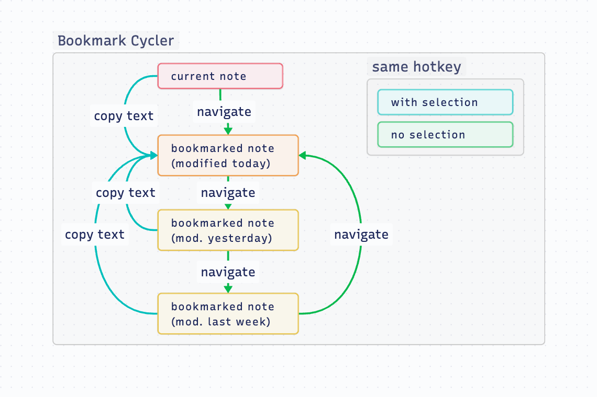
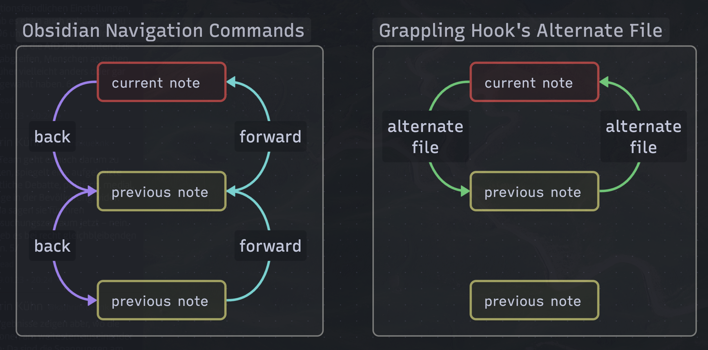

# 🪝 Grappling Hook

 

Obsidian Plugin for blazingly fast file switching. For those who find the Quick Switcher still too slow. [Endorsed by Nick Milo.](https://youtu.be/mcrcRXp5d8A?t=462)

## Table of Contents

<!--toc:start-->
- [Features](#features)
	- [Bookmark Cycler](#bookmark-cycler)
	- [Alternate Note](#alternate-note)
- [Installation](#installation)
- [About the developer](#about-the-developer)
<!--toc:end-->

## Features

### Bookmark Cycler
Goes to your most recently modified bookmarked note. If you are already at a bookmarked note, goes to the next bookmarked note, in order of the last modification date. This allows you to quickly cycle between a core set of files that are important. The command works well for workflows where you work with a dynamic core set of main notes and many auxiliary notes.

When you have text selected, the bookmark cycler switches to its alternative mode, and copies the selected text to the last modified bookmarked note, regardless the note you are.

> __Note__  
> Only bookmarked *files* are considered. Bookmarked *blocks* or *headers* are ignored.

*This command is inspired by the [Harpoon plugin for neovim](https://github.com/ThePrimeagen/harpoon).*

### Alternate Note
Go to the last file you were at. As opposed to the `Navigate Back` command, using the `Switch to Alternate Note` command moves you forward in history when you press it the second time. This allows you to rapidly switch between two files with only one hotkey. The name of the alternate file is also displayed in the status bar.

*This command is an emulation of vim's `:buffer #`.*

## Installation
The plugin is available in Obsidian's Community Plugin Browser via: `Settings` → `Community Plugins` → `Browse` → Search for *"🪝 Grappling Hook"*

<!-- vale Google.FirstPerson = NO -->
## About the developer
In my day job, I am a sociologist studying the social mechanisms underlying the digital economy. For my PhD project, I investigate the governance of the app economy and how software ecosystems manage the tension between innovation and compatibility. If you are interested in this subject, feel free to get in touch.

__Profiles__  
- [Academic Website](https://chris-grieser.de/)
- [ResearchGate](https://www.researchgate.net/profile/Christopher-Grieser)
- [Discord](https://discordapp.com/users/462774483044794368/)
- [GitHub](https://github.com/chrisgrieser/)
- [Twitter](https://twitter.com/pseudo_meta)
- [LinkedIn](https://www.linkedin.com/in/christopher-grieser-ba693b17a/)

__Buy Me a Coffee__  
 

