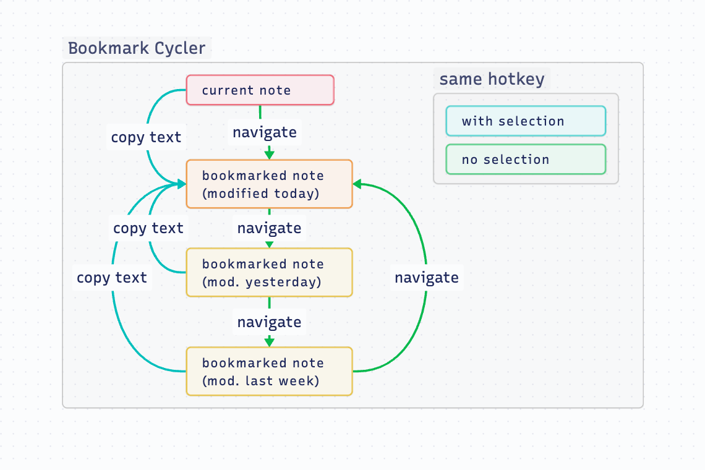
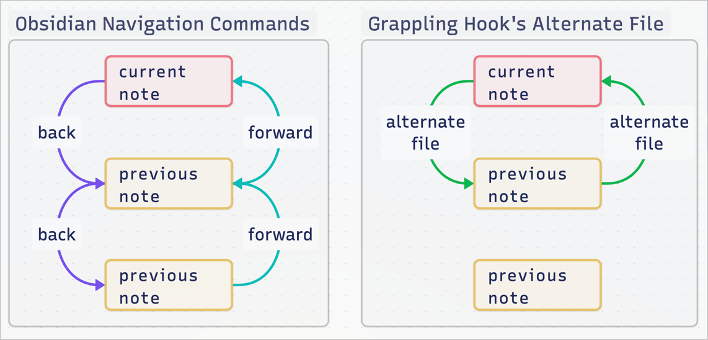

# Grappling hook 🪝

Obsidian Plugin for blazingly fast file switching. For those who find the Quick
Switcher still too slow. [Endorsed by Nick Milo.](https://youtu.be/mcrcRXp5d8A?t=462)

<!-- toc -->

- [Commands](#commands)
    - [Bookmark cycler](#bookmark-cycler)
    - [Alternate note](#alternate-note)
    - [Cycle tab/split](#cycle-tabsplit)
    - [Next/previous file in current folder](#nextprevious-file-in-current-folder)
    - [Open first URL in file](#open-first-url-in-file)
- [Installation](#installation)
- [About the developer](#about-the-developer)

<!-- tocstop -->

## Commands

### Bookmark cycler
Goes to your most recently modified bookmarked note. If you are already at a
bookmarked note, goes to the next bookmarked note, in order of the last
modification date. This allows you to quickly cycle between a core set of files
that are important. The command works well for workflows where you work with a
dynamic core set of main notes and many auxiliary notes.

When you have text selected, the bookmark cycler switches to its alternative
mode, and copies the selected text to the last modified bookmarked note,
regardless the note you are.

> [!NOTE]
> Only bookmarked *files* are considered. Bookmarked *blocks* or *headers* are ignored.

*This command is inspired by the [Harpoon plugin for neovim](https://github.com/ThePrimeagen/harpoon).*

### Alternate note
Go to the last file you were at. As opposed to the `Navigate Back` command,
using the `Switch to Alternate Note` command moves you forward in history when
you press it the second time. This allows you to rapidly switch between two
files with only one hotkey. *This command is equivalent to vim's `:buffer #`.*  

The name of the alternate file is also displayed in the status bar. If the
alternate file is already open in another tab, it switches to that tab. If not,
the alternate file is opened in the current tab.

### Cycle tab/split
Like the Obsidian built-in command `Go to next tab`, but includes tabs in other
splits, meaning you can cycle through *all* open tabs with one hotkey.
*This command similar to vim's `:<C-w>w`.*

### Next/previous file in current folder
Cycles through all files in the current folder, in alphabetical order.

### Open first URL in file
Opens the first URL (external link) found in the file. This includes the
frontmatter. Currently, works only in Source Mode and Live Preview.

Note that this only works with URLs that are *actually* in the file, meaning
URLs displayed via dataview or embedded notes are not supported.

## Installation
➡️ [Install in Obsidian](https://obsidian.md/plugins?id=grappling-hook)

<!-- vale Google.FirstPerson = NO -->
## About the developer
In my day job, I am a sociologist studying the social mechanisms underlying the
digital economy. For my PhD project, I investigate the governance of the app
economy and how software ecosystems manage the tension between innovation and
compatibility. If you are interested in this subject, feel free to get in touch.

- [Academic Website](https://chris-grieser.de/)
- [Mastodon](https://pkm.social/@pseudometa)
- [ResearchGate](https://www.researchgate.net/profile/Christopher-Grieser)
- [LinkedIn](https://www.linkedin.com/in/christopher-grieser-ba693b17a/)

If you find this project helpful, you can support me via [🩷 GitHub
Sponsors](https://github.com/sponsors/chrisgrieser?frequency=one-time).
